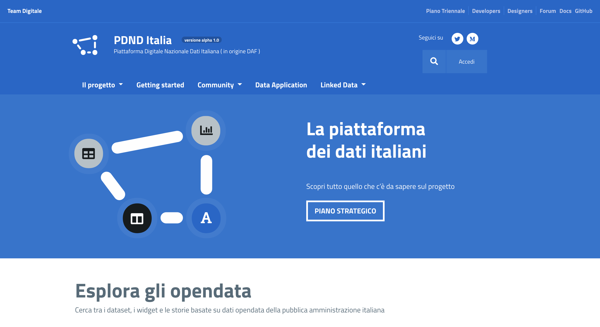
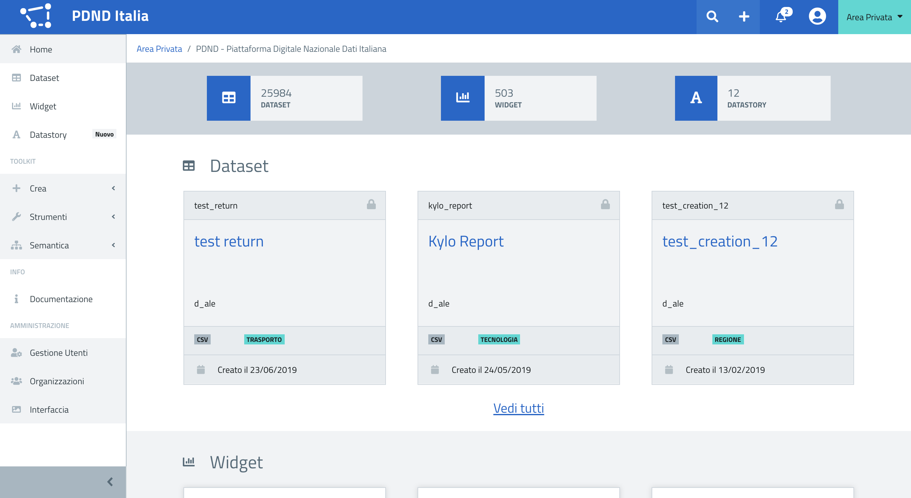

# DAF Dataportal for Piattaforma Digitale Nazionale Dati (PDND), previously DAF

<!-- > Insert here the application logo and badges if present.-->


[Build Status](http://131.1.252.41/job/CI-DataPortal_Frontend/job/testCI/badge/icon)

The DAF Dataportal is the front-end project of the PDND portal available at this [link](https://dataportal.daf.teamdigitale.it).

All the documentation and the user manual can be reached at [this page](https://docs.italia.it/italia/daf/daf-dataportal-it-docs/it/master/) of **Docs Italia** portal.

## What is the PDND (ex DAF)?

PDND stays for "Piattaforma Digitale Nazionale Dati" (the Italian Digital Data Platform), previously known as Data & Analytics Framework (DAF).

You can find more informations about the PDND on the official [Digital Transformation Team website](https://teamdigitale.governo.it/it/projects/daf.htm).

## What is DAF Dataportal?

<!-- Insert here an extended description of the project with informations about context, goals, stakeholders, use cases, and finally the role of the project within the PDND with links to other repositories requiring this code or this code depends on. Embed also screenshots or video if present to give a preview of the application.-->

The project of the DAF Dataportal is the UI interface of the PDND, the Italian Digital Data Platform.

The project combines both the public site and the private dashboard. Within the public site it is possible to access 
and navigate the OpenData and public contents created and published through the PDND.



The private section is aimed to contribute, creating new datasets (if the user is linked to any of the Public 
Organizations partecipating the platform) or writing down new datastories.



DAF Dataportal is the entry point of the Piattaforma Digitale Nazionale Dati, the way to consult _datasets_ information and 
the use cases for _datasets_ and the place to create new content: Datastory and Datasets.

<!-- Insert here informations about files and folders structure, branch model adopted and release policy. -->
The *master* branch refers to the code available for the production release ([reachable here](https://dataportal.daf.teamdigitale.it)).
All the development starts from *dev* branch working on feature branches and merged first on _dev_ and after testing and reviewing 
can be merged on master. 

### Project components

This project depends by the following components.

* **React** version 16.8.6, available [here](https://it.reactjs.org/).

* **Redux** version 4.0.1, available [here](https://redux.js.org/).

* **Webpack** version 4.29.6, available [here](https://webpack.js.org/).

### Related PDND Services

* **DAF Catalog Manager** available [here](https://github.com/italia/daf-srv-catalog/tree/master)
* **DAF Security Manager** available [here](https://github.com/italia/daf-srv-security/tree/master)
* **DAF Dataportal Backend** available [here](https://github.com/italia/daf-dataportal-backend)

## How to install and use DAF Dataportal

### Clone the project 
```
git clone https://github.com/italia/daf-dataportal.git
```

### Configure your local environment
To make the magic happen are required:
- Node.JS
- NPM

You can install them following [this guide](https://nodejs.org/en/download/package-manager/)

Add to your host file the following urls

```
localhost.dataportal.daf.teamdigitale.it

localhost.dataportal.daf.teamdigitale.test
```

### Install all packages and dependencies
```
npm install
```

### Run the app
```
npm start
```

If you are on the `master` branch point your browser on `localhost.dataportal.daf.teamdigitale.it`, in the other hand `localhost.dataportal.daf.teamdigitale.test` will work for you.

## How to build and test DAF Dataportal

<!--> Insert here a brief documentation for the developer to build, test and contribute. Insert a link to an extended documentation (developer manual) if present.-->

There's two ways to build up the project the first (and simple one) running the following command via terminal
```
npm run build  
```

The second (and more geeky) is based on Docker (You can find all the following informations [here](https://docs.docker.com/get-started/))
```
sudo docker build --no-cache -t <YOUR_DOCKER_IMAGE_NAME> .
```

**NOTE**: In order to work properly it's necessary a running instance of the related PDND services (see the related paragraph). 
The endpoint for all the services and *API* can be found at `src/config/serviceurl.js` and can be edited to target 
the correct endpoint of the services above, otherwise the application will target to the default production endpoints.
 
## How to contribute

Contributions are welcome. Feel free to [open issues](./issues) and submit a [pull request](./pulls) at any time, but please read [our handbook](https://github.com/teamdigitale/daf-handbook) first.

## License

Copyright (c) 2019 Presidenza del Consiglio dei Ministri

This program is free software: you can redistribute it and/or modify it under the terms of the GNU Affero General Public License as published by the Free Software Foundation, either version 3 of the License, or (at your option) any later version.

This program is distributed in the hope that it will be useful, but WITHOUT ANY WARRANTY; without even the implied warranty of MERCHANTABILITY or FITNESS FOR A PARTICULAR PURPOSE. See the GNU Affero General Public License for more details.

You should have received a copy of the GNU Affero General Public License along with this program.  If not, see <https://www.gnu.org/licenses/>.
